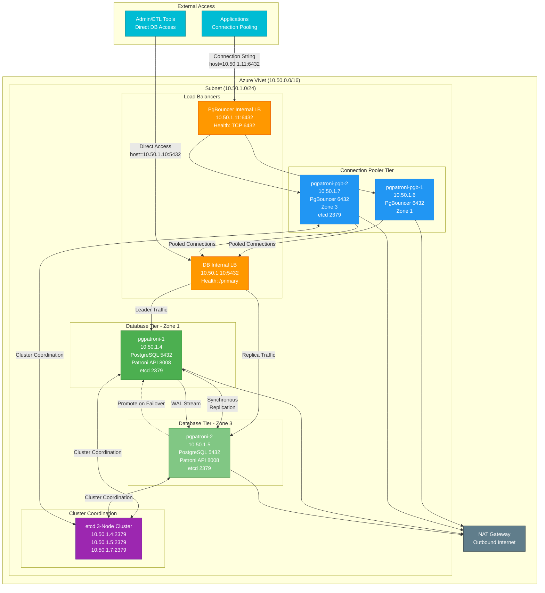
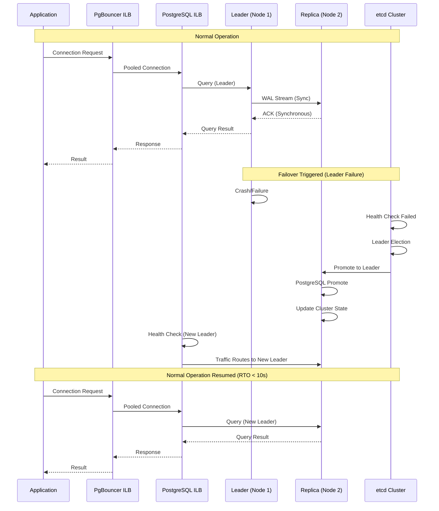
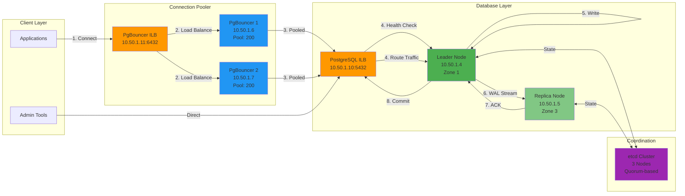

# Azure Patroni HA PostgreSQL - Cluster Details

Bu dokümantasyon, Azure üzerinde kurulu PostgreSQL High Availability (HA) cluster'ının detaylı bilgilerini içermektedir. Sistem mimari detayları, erişim bilgileri ve kullanım talimatları aşağıda yer almaktadır.

---

## 📋 Genel Bakış

Bu çözüm, **Patroni** tabanlı PostgreSQL High Availability cluster'ı içermektedir ve şu özellikleri sağlar:

- ✅ **Zero Data Loss (RPO=0)**: Senkron replikasyon ile veri kaybı yok
- ✅ **Hızlı Failover**: Otomatik failover ile RTO < 10 saniye
- ✅ **Connection Pooling**: PgBouncer ile yüksek performans ve ölçeklenebilirlik
- ✅ **Multi-Zone Deployment**: Availability Zone'lar arasında dağıtım
- ✅ **Otomatik Recovery**: Node kayıplarında otomatik recovery

---

## 🏗️ Mimari Detaylar

### Mimari Diagram



### Mimari Açıklama

**Katmanlı Mimari:**
1. **Application Layer**: Uygulamalar PgBouncer ILB üzerinden bağlanır
2. **Connection Pooler Layer**: PgBouncer transaction pooling ile bağlantı yönetimi
3. **Database Layer**: Patroni yönetiminde PostgreSQL cluster (Leader + Replica)
4. **Coordination Layer**: etcd 3-node cluster ile cluster state yönetimi
5. **Network Layer**: Internal Load Balancer'lar ile trafik yönlendirme

**Replikasyon:**
- **Synchronous Replication**: Zero data loss (RPO=0) garantisi
- **Automatic Failover**: Leader fail olduğunda otomatik switchover
- **Load Balancing**: ILB ile leader'a trafik yönlendirme

**Yüksek Erişilebilirlik:**
- Multi-Zone deployment (Zone 1 ve Zone 3)
- Health checks ile otomatik failover
- Connection pooling ile yüksek performans

### Trafik Akışı Diyagramı

```
┌─────────────────────────────────────────────────────────────────┐
│                        APPLICATION LAYER                        │
│  ┌──────────────┐                    ┌─────────────────────┐   │
│  │ Applications │                    │ Admin/ETL Tools    │   │
│  │ (PgBouncer)  │                    │ (Direct DB)         │   │
│  └──────┬───────┘                    └──────────┬──────────┘   │
└─────────┼───────────────────────────────────────┼──────────────┘
          │                                        │
          │ host=10.50.1.11:6432                   │ host=10.50.1.10:5432
          │                                        │
┌─────────▼───────────────────────────────────────▼──────────────┐
│                    LOAD BALANCER TIER                           │
│  ┌──────────────────────┐      ┌──────────────────────────┐   │
│  │ PgBouncer ILB        │      │ PostgreSQL ILB           │   │
│  │ 10.50.1.11:6432      │      │ 10.50.1.10:5432          │   │
│  │ Health: TCP 6432    │      │ Health: HTTP 8008/primary  │   │
│  └──────────┬───────────┘      └──────────┬───────────────┘   │
└─────────────┼─────────────────────────────┼───────────────────┘
              │                               │
              │ Pooled Connections            │ Direct Connections
              │                               │
┌─────────────▼───────────────────────────────▼──────────────────┐
│                  CONNECTION POOLER TIER                          │
│  ┌────────────────────────┐     ┌──────────────────────────┐    │
│  │ PgBouncer VM 1         │     │ PgBouncer VM 2           │    │
│  │ 10.50.1.6 (Zone 1)     │     │ 10.50.1.7 (Zone 3)      │    │
│  │ Port: 6432             │     │ Port: 6432              │    │
│  │ Pool Size: 200         │     │ Pool Size: 200          │    │
│  └───────────┬────────────┘     └────────────┬─────────────┘    │
└──────────────┼────────────────────────────────┼──────────────────┘
               │                                  │
               └──────────┬───────────────────────┘
                          │
┌─────────────────────────▼──────────────────────────────────────┐
│                    DATABASE TIER                                │
│  ┌────────────────────────┐     ┌──────────────────────────┐   │
│  │ PostgreSQL Node 1      │◄────┤ PostgreSQL Node 2        │   │
│  │ pgpatroni-1            │     │ pgpatroni-2              │   │
│  │ 10.50.1.4 (Zone 1)     │     │ 10.50.1.5 (Zone 3)      │   │
│  │ Leader/Primary         │     │ Sync Standby/Replica    │   │
│  │ PostgreSQL: 5432       │WAL  │ PostgreSQL: 5432        │   │
│  │ Patroni API: 8008      │Stream│ Patroni API: 8008        │   │
│  │ etcd: 2379             │     │ etcd: 2379              │   │
│  └───────────┬────────────┘     └────────────┬─────────────┘   │
└──────────────┼────────────────────────────────┼─────────────────┘
               │                                  │
               └──────────────┬───────────────────┘
                              │
┌─────────────────────────────▼──────────────────────────────────┐
│              CLUSTER COORDINATION (etcd)                        │
│  ┌─────────────────────────────────────────────────────────┐   │
│  │ etcd 3-Node Cluster (Quorum-based)                    │   │
│  │  • 10.50.1.4:2379 (pgpatroni-1)                        │   │
│  │  • 10.50.1.5:2379 (pgpatroni-2)                        │   │
│  │  • 10.50.1.7:2379 (pgpatroni-pgb-2)                    │   │
│  │                                                         │   │
│  │ Manages: Cluster state, Leader election, Configuration │   │
│  └─────────────────────────────────────────────────────────┘   │
└─────────────────────────────────────────────────────────────────┘

LEGEND:
  ─────  Application Traffic
  ════  Replication Traffic
  ──►   Data Flow Direction
  ◄──►  Bidirectional Communication
```

**Trafik Akışı Açıklaması:**

1. **Application Traffic**:
   - Uygulamalar → PgBouncer ILB (10.50.1.11:6432) → PgBouncer VM'ler → PostgreSQL ILB (10.50.1.10:5432) → Leader Node

2. **Admin Traffic**:
   - Admin/ETL Tools → PostgreSQL ILB (10.50.1.10:5432) → Leader Node (doğrudan)

3. **Replication Traffic**:
   - Leader Node (10.50.1.4) → WAL Stream → Replica Node (10.50.1.5)
   - Senkron replikasyon: Commit, replica'dan acknowledgment bekler

4. **Cluster Coordination**:
   - Tüm node'lar → etcd cluster (leader election, state management)

5. **Failover Scenario**:
   - Leader fail → etcd leader election → Replica promote → ILB health check → Traffic yeni leader'a

### Failover Sequence Diagram



### Network Topology Diagram

```
┌──────────────────────────────────────────────────────────────────────────┐
│                         AZURE RESOURCE GROUP                            │
└──────────────────────────────────────────────────────────────────────────┘
                              │
                              ▼
        ┌─────────────────────────────────────────────────────┐
        │           Virtual Network (10.50.0.0/16)             │
        │  ┌─────────────────────────────────────────────────┐ │
        │  │         Subnet: db (10.50.1.0/24)              │ │
        │  │                                                 │ │
        │  │  ┌──────────────┐      ┌──────────────┐      │ │
        │  │  │  Zone 1      │      │  Zone 3      │      │ │
        │  │  │              │      │              │      │ │
        │  │  │ ┌──────────┐ │      │ ┌──────────┐ │      │ │
        │  │  │ │  DB VM 1 │ │      │ │  DB VM 2 │ │      │ │
        │  │  │ │ 10.50.1.4│ │◄─────┤ │ 10.50.1.5│ │      │ │
        │  │  │ │ PostgreSQL│ │WAL   │ │ PostgreSQL│ │      │ │
        │  │  │ │ Patroni   │ │Stream│ │ Patroni   │ │      │ │
        │  │  │ │ etcd      │ │      │ │ etcd      │ │      │ │
        │  │  │ └─────┬─────┘ │      │ └─────┬─────┘ │      │ │
        │  │  │       │       │      │       │       │      │ │
        │  │  │ ┌─────▼─────┐ │      │ ┌─────▼─────┐ │      │ │
        │  │  │ │ PgBouncer │ │      │ │ PgBouncer │ │      │ │
        │  │  │ │ 10.50.1.6 │ │      │ │ 10.50.1.7 │ │      │ │
        │  │  │ └───────────┘ │      │ └───────────┘ │      │ │
        │  │  └──────────────┘      └──────────────┘      │ │
        │  │                                                 │ │
        │  │  ┌──────────────────────────────────────────┐ │ │
        │  │  │        Internal Load Balancers            │ │ │
        │  │  │  ┌────────────────┐  ┌────────────────┐  │ │ │
        │  │  │  │  DB ILB        │  │  PgB ILB       │  │ │ │
        │  │  │  │  10.50.1.10   │  │  10.50.1.11    │  │ │ │
        │  │  │  │  Port: 5432   │  │  Port: 6432    │  │ │ │
        │  │  │  └───────────────┘  └────────────────┘  │ │ │
        │  │  └──────────────────────────────────────────┘ │ │
        │  │                                                 │ │
        │  │  ┌──────────────────────────────────────────┐ │ │
        │  │  │         Network Security Group          │ │ │
        │  │  │  • SSH (22)                              │ │ │
        │  │  │  • PostgreSQL (5432) - VNet only         │ │ │
        │  │  │  • PgBouncer (6432) - VNet only         │ │ │
        │  │  │  • Patroni API (8008) - VNet only       │ │ │
        │  │  │  • etcd (2379-2380) - VNet only         │ │ │
        │  │  │  • Azure Load Balancer probes           │ │ │
        │  │  └──────────────────────────────────────────┘ │ │
        │  └─────────────────────────────────────────────────┘ │
        │                                                        │
        │  ┌──────────────────────────────────────────────┐     │
        │  │           NAT Gateway (Outbound)              │     │
        │  │  • Package installations                      │     │
        │  │  • System updates                            │     │
        │  └──────────────────────────────────────────────┘     │
        └────────────────────────────────────────────────────────┘
                              │
                              ▼
        ┌─────────────────────────────────────────────────────────┐
        │              Azure Storage & Resources                   │
        │  • Managed Disks (Premium SSD)                          │
        │    - Data Disk: 1024 GB per DB VM                       │
        │    - WAL Disk: 512 GB per DB VM                         │
        │  • Network Interfaces                                   │
        │  • Public IPs (optional, if Public LB enabled)         │
        └─────────────────────────────────────────────────────────┘
```

### Data Flow Diagram (Detaylı)



**Data Flow Açıklaması:**

1. **Application Request Flow**:
   ```
   Application → PgBouncer ILB → PgBouncer VM → PostgreSQL ILB → Leader Node → Response
   ```

2. **Write Transaction Flow**:
   ```
   Write → Leader → WAL Write → WAL Stream to Replica → Sync ACK → Commit → Response
   ```

3. **Read Transaction Flow**:
   ```
   Read → Leader → Data Return → Response
   ```

4. **Connection Pooling Benefit**:
   - 1000 application connections → 200 pooled connections → 100 PostgreSQL connections
   - Dramatic resource savings and performance improvement

### Altyapı Bileşenleri

#### **1. Database Tier (PostgreSQL Cluster)**
- **Node Sayısı**: 2 veya 3 (yapılandırılabilir)
- **VM Boyutu**: Standard_D32s_v6 (varsayılan - **v6 serisi maksimum performans için**)
  - **CPU**: 32 vCPU
  - **RAM**: 128 GB
  - **Performans**: En yeni nesil Intel/AMD işlemciler, geliştirilmiş ağ performansı, yüksek paralel işlem kapasitesi
- **Diskler**:
  - **OS Disk**: Premium SSD (Premium_LRS - OS diskler için maksimum seçenek)
  - **Data Disk**: 1024 GB Premium SSD v2 (PremiumV2_LRS - **en yüksek IOPS ve throughput**)
  - **WAL Disk**: 512 GB Premium SSD v2 (PremiumV2_LRS)
  - **Disk Performansı**: Premium SSD v2 data diskler, Premium SSD'ye göre çok daha yüksek IOPS (80,000+ IOPS) ve throughput (1,200 MB/s+)
- **PostgreSQL Versiyonu**: 16.10
- **Replikasyon**: Senkron replikasyon (synchronous standby)
- **Max Connections**: 500 (optimize edilmiş)
- **Patroni Failover Süresi**: 4-7 saniye (loop_wait=5s optimize edilmiş)
- **etcd Cluster**: 3-node (2 DB + 1 PgBouncer)

#### **2. Load Balancer Tier**
- **Database Internal Load Balancer**:
  - Private IP: `10.50.1.10`
  - Port: `5432` (PostgreSQL)
  - Health Check: HTTP `8008/primary` (Patroni API)
- **PgBouncer Internal Load Balancer**:
  - Private IP: `10.50.1.11`
  - Port: `6432` (PgBouncer)
  - Health Check: TCP `6432`

#### **3. Connection Pooler Tier (PgBouncer)**
- **Node Sayısı**: 2 (Zone 1 ve Zone 3)
- **VM Boyutu**: Standard_D16s_v6 (**v6 serisi maksimum performans için**)
  - **CPU**: 16 vCPU
  - **RAM**: 64 GB
- **OS Disk**: Premium SSD (Premium_LRS - OS diskler için maksimum seçenek)
- **Pool Mode**: Transaction
- **Default Pool Size**: 600 bağlantı (optimize edilmiş)
- **Max Client Connections**: 6000 bağlantı (optimize edilmiş)

#### **4. Cluster Coordination (etcd)**
- **Node Sayısı**: 3-node etcd cluster
- **Nodes**: DB VMs (2 adet) + PgBouncer VM (1 adet)
- **Endpoints**: 
  - `10.50.1.4:2379`
  - `10.50.1.5:2379`
  - `10.50.1.7:2379`

---

## 🔐 Erişim Bilgileri

### Network Bilgileri

| Bileşen | Private IP | Port | Açıklama |
|---------|------------|------|----------|
| **PostgreSQL ILB** | 10.50.1.10 | 5432 | Doğrudan DB erişimi (admin, ETL, replication) |
| **PgBouncer ILB** | 10.50.1.11 | 6432 | Uygulama bağlantıları için (önerilen) |
| **DB VM 1** | 10.50.1.4 | 5432, 8008 | Zone 1 - Patroni API: `http://10.50.1.4:8008` |
| **DB VM 2** | 10.50.1.5 | 5432, 8008 | Zone 3 - Patroni API: `http://10.50.1.5:8008` |
| **PgBouncer VM 1** | 10.50.1.6 | 6432 | Zone 1 |
| **PgBouncer VM 2** | 10.50.1.7 | 6432 | Zone 3 (etcd node) |

### Kimlik Doğrulama Bilgileri

**VM Erişimi:**
- **Kullanıcı Adı**: `azureuser`
- **Şifre**: `Azure123!@#` (varsayılan - **ÖNERİLİR: Değiştirin**)

**PostgreSQL:**
- **Superuser**: `postgres`
- **Şifre**: `ChangeMe123Pass` (varsayılan - **KRİTİK: Değiştirin**)
- **Replicator User**: `replicator`
- **Replicator Şifresi**: `ChangeMe123Pass` (varsayılan - **ÖNERİLİR: Değiştirin**)

**PgBouncer:**
- **Admin User**: `pgbouncer`
- **Admin Şifre**: `StrongPass123` (varsayılan - **ÖNERİLİR: Değiştirin**)

---

## 🔌 Bağlantı Örnekleri

### Uygulama Bağlantısı (PgBouncer üzerinden - ÖNERİLEN)

```bash
# PostgreSQL connection string (PgBouncer üzerinden)
host=10.50.1.11 port=6432 dbname=postgres user=postgres password=ChangeMe123Pass

# psql ile bağlantı
psql "host=10.50.1.11 port=6432 dbname=postgres user=postgres password=ChangeMe123Pass"

# Python örneği
import psycopg2
conn = psycopg2.connect(
    host="10.50.1.11",
    port=6432,
    database="postgres",
    user="postgres",
    password="ChangeMe123Pass"
)
```

### Doğrudan Database Bağlantısı (Admin/ETL için)

```bash
# psql ile doğrudan bağlantı
psql "host=10.50.1.10 port=5432 dbname=postgres user=postgres password=ChangeMe123Pass"

# PGPASSWORD environment variable ile
export PGPASSWORD='ChangeMe123Pass'
psql -h 10.50.1.10 -p 5432 -U postgres -d postgres
```

### PgBouncer Admin Konsolu

```bash
# PgBouncer admin konsoluna bağlantı
psql "host=10.50.1.11 port=6432 dbname=pgbouncer user=pgbouncer password=StrongPass123"

# Pool durumunu kontrol etme
SHOW POOLS;
SHOW STATS;
SHOW CLIENTS;
```

---

## 📊 Cluster Durumunu Kontrol Etme

### Patroni Cluster Status

```bash
# Cluster durumunu görüntüle
curl -s http://10.50.1.4:8008/cluster | jq

# Sadece leader'ı görüntüle
curl -s http://10.50.1.4:8008/cluster | jq '.members[] | select(.role=="leader")'

# Replica'ları görüntüle
curl -s http://10.50.1.4:8008/cluster | jq '.members[] | select(.role!="leader")'
```

### PostgreSQL Replikasyon Durumu

```bash
# psql ile replikasyon durumunu kontrol et
psql "host=10.50.1.10 port=5432 dbname=postgres user=postgres password=ChangeMe123Pass" \
  -c "SELECT application_name, state, sync_state, sync_priority, client_addr FROM pg_stat_replication;"
```

### etcd Cluster Health

```bash
# etcd cluster member listesi
ETCDCTL_API=3 etcdctl --endpoints=http://10.50.1.4:2379,http://10.50.1.5:2379,http://10.50.1.7:2379 member list

# etcd health check
curl -s http://10.50.1.4:2379/health
curl -s http://10.50.1.5:2379/health
curl -s http://10.50.1.7:2379/health
```

---

## ✅ Otomatik Test ve Doğrulama

Deployment sonrası sistem sağlığını kontrol etmek için kapsamlı test scripti mevcuttur:

```bash
# Herhangi bir DB VM'den test scriptini çalıştırın (Direct DB)
curl -fsSL https://raw.githubusercontent.com/gokhansalihyenigun/azure-patroni-ha/main/scripts/test-deployment.sh | sudo bash

# PgBouncer üzerinden test (önerilen - gerçekçi senaryo)
export USE_PGBOUNCER=true; curl -fsSL https://raw.githubusercontent.com/gokhansalihyenigun/azure-patroni-ha/main/scripts/test-deployment.sh | sudo -E bash
```

**Test Script'i Kontrol Eder:**
- ✅ VM connectivity (DB + PgBouncer)
- ✅ Patroni cluster health (leader + replicas)
- ✅ PostgreSQL connections (direct + Load Balancer)
- ✅ PgBouncer functionality ve connection pooling
- ✅ Replication status ve lag
- ✅ etcd cluster health
- ✅ High availability configuration
- ✅ Performance benchmarks (QPS, TPS, latency)
- ✅ Failover testleri (normal ve yük altında - 2k/3k/4k/8k QPS)
- ✅ Zero Data Loss (RPO=0) validation
- ✅ Write performance (TPS measurement)
- ✅ Latency testleri (p50, p95, p99)
- ✅ Sustained load test (5 dakika)
- ✅ Concurrent connection stress test
- ✅ Replication lag monitoring
- ✅ Large transaction test

---

## 🚀 Performans Metrikleri

Test edilen performans değerleri:

| Metrik | Değer | Notlar |
|--------|-------|--------|
| **Failover Süresi** | 4-7 saniye | Normal operasyon |
| **Failover (2000 QPS)** | ~4-5 saniye | Hafif yük altında |
| **Failover (4000 QPS)** | ~4-6 saniye | Orta yük altında |
| **Failover (8000 QPS)** | ~4-7 saniye | Yüksek yük altında |
| **RPO (Recovery Point Objective)** | 0 | Senkron replikasyon ile zero data loss |
| **RTO (Recovery Time Objective)** | < 10 saniye | Otomatik failover |
| **Connection Pool** | 600 aktif | PgBouncer optimized pool size |
| **Max Connections** | 6000 client | PgBouncer optimized max client connections |
| **PostgreSQL Max Connections** | 500 | Optimize edilmiş (default: 100) |
| **Write Performance (TPS)** | ~1,182 TPS | 50 clients, 8 jobs |
| **Latency (p50)** | ~1.08 ms | Excellent for OLTP |
| **Concurrent Connections** | 200+ | Tested successfully |

---

## 🔄 Failover Senaryoları

### Otomatik Failover

Sistem otomatik olarak failover yapar:
1. Leader node'un sağlık kontrolü başarısız olursa
2. Network partition durumunda
3. VM crash veya reboot durumunda
4. PostgreSQL crash durumunda

### Manuel Switchover (Zero-Downtime)

Planlı bakım için manuel switchover yapılabilir:

```bash
# Leader ve candidate'ı belirle
LEADER=$(curl -s http://10.50.1.4:8008/cluster | jq -r '.members[] | select(.role=="leader") | .name')
CANDIDATE=$(curl -s http://10.50.1.4:8008/cluster | jq -r '.members[] | select(.role=="sync_standby") | .name')

# Leader IP'yi bul
LEADER_IP=$(curl -s http://10.50.1.4:8008/cluster | jq -r --arg L "$LEADER" '.members[] | select(.name==$L) | .host')

# Switchover isteği
curl -X POST "http://${LEADER_IP}:8008/switchover" \
  -H "Content-Type: application/json" \
  -d "{\"leader\":\"${LEADER}\",\"candidate\":\"${CANDIDATE}\"}"
```

---

## 🛡️ Güvenlik Önerileri

**KRİTİK - İlk Adımlar:**
1. ✅ **PostgreSQL şifrelerini değiştirin**: `postgres` ve `replicator` kullanıcı şifrelerini güçlü şifrelerle değiştirin
2. ✅ **PgBouncer admin şifresini değiştirin**: `pgbouncer` admin şifresini değiştirin
3. ✅ **VM admin şifresini değiştirin**: `azureuser` şifresini değiştirin
4. ✅ **Firewall kurallarını gözden geçirin**: NSG kurallarını ihtiyaçlarınıza göre daraltın
5. ✅ **Public endpoint'leri kapatın**: Public load balancer kullanmıyorsanız `enablePublicLB=false` olarak bırakın

**Öneriler:**
- PostgreSQL SSL/TLS bağlantılarını etkinleştirin
- Network Security Group (NSG) kurallarını production gereksinimlerine göre özelleştirin
- Azure Key Vault ile şifre yönetimi yapın
- Regular backup stratejisi oluşturun

---

## 💾 Yedekleme ve Recovery

### Otomatik Yedekleme

Sistem şu an için otomatik yedekleme içermemektedir. Production ortamında aşağıdaki yedekleme stratejilerini öneriyoruz:

1. **Azure Backup**: VM-level backup
2. **pg_basebackup**: PostgreSQL native backup
3. **pg_dump / pg_dumpall**: Logical backup
4. **WAL Archiving**: Point-in-time recovery (PITR) için

### Manuel Yedekleme Örneği

```bash
# pg_dump ile database yedekleme
pg_dump -h 10.50.1.10 -p 5432 -U postgres -F c -b -v -f backup_$(date +%Y%m%d_%H%M%S).dump postgres

# pg_basebackup ile physical backup
pg_basebackup -h 10.50.1.10 -p 5432 -U replicator -D /backup/pg_basebackup -Ft -z -P
```

---

## 📈 Monitoring ve Alerting

### Önerilen Monitoring Metrikleri

- **PostgreSQL Metrics:**
  - Connection count
  - Query performance
  - Replication lag
  - Disk usage
  - CPU/Memory usage

- **Patroni Metrics:**
  - Leader status
  - Replica lag
  - Cluster member health

- **PgBouncer Metrics:**
  - Active connections
  - Pool usage
  - Query rate
  - Wait time

### Azure Monitor Integration

VM'lere Azure Monitor Agent kuruludur. Azure Portal'dan veya Log Analytics Workspace üzerinden monitoring yapılabilir.

---

## 🔧 Bakım ve Operasyon

### Servis Yönetimi

```bash
# Patroni servis durumu
sudo systemctl status patroni

# PostgreSQL restart (Patroni üzerinden - önerilen)
sudo systemctl restart patroni

# PgBouncer restart
sudo systemctl restart pgbouncer

# etcd restart
sudo systemctl restart etcd
```

### Log Dosyaları

```bash
# Patroni logs
sudo journalctl -u patroni -f

# PostgreSQL logs
sudo tail -f /var/log/postgresql/postgresql-16-main.log

# PgBouncer logs
sudo journalctl -u pgbouncer -f
```

### Disk Alanı Kontrolü

```bash
# Data disk kullanımı
df -h /pgdata

# WAL disk kullanımı
df -h /pgwal
```

---

## 📞 Destek ve Dokümantasyon

### GitHub Repository

Tüm kod ve dokümantasyon:
**https://github.com/gokhansalihyenigun/azure-patroni-ha**

### İlgili Dokümantasyon

- **Patroni**: https://patroni.readthedocs.io/
- **PostgreSQL**: https://www.postgresql.org/docs/
- **PgBouncer**: https://www.pgbouncer.org/

### Deploy Script

Yeni bir deployment yapmak için:
**[Deploy to Azure Button](https://portal.azure.com/#create/Microsoft.Template/uri/https%3A%2F%2Fraw.githubusercontent.com%2Fgokhansalihyenigun%2Fazure-patroni-ha%2Fmain%2Fazuredeploy.json)**

---

## ⚠️ Önemli Notlar

1. **Default Şifreler**: Tüm default şifreler production ortamında **MUTLAKA** değiştirilmelidir.

2. **Network Erişimi**: Bu deployment Internal Load Balancer kullanmaktadır. VNet dışından erişim için Public Load Balancer (`enablePublicLB=true`) veya VPN/ExpressRoute yapılandırması gerekir.

3. **Zone Outage**: Sistem zone-level outage'lara karşı korumalıdır. Bir zone tamamen kaybedilirse, diğer zone'daki node'lar otomatik olarak devralır.

4. **Connection Limits**: PostgreSQL default connection limit (100) yerine cluster yönetimi için optimize edilmiştir. PgBouncer üzerinden bağlanan uygulamalar için connection pooling ile yüksek ölçeklenebilirlik sağlanır.

5. **Backup Strategy**: Production ortamında mutlaka yedekleme stratejisi oluşturulmalıdır.

---

## 📋 Checklist - Deployment Sonrası

- [ ] PostgreSQL şifrelerini değiştir (`postgres`, `replicator`)
- [ ] PgBouncer admin şifresini değiştir
- [ ] VM admin şifresini değiştir
- [ ] Test scriptini çalıştır ve sonuçları doğrula
- [ ] NSG kurallarını production gereksinimlerine göre gözden geçir
- [ ] Monitoring ve alerting kurulumunu yap
- [ ] Yedekleme stratejisini oluştur ve test et
- [ ] Uygulama bağlantılarını test et
- [ ] Failover senaryolarını test et (planlı maintenance window'da)
- [ ] Dokümantasyonu ekibinizle paylaş

---

*Bu dokümantasyon Azure Patroni HA PostgreSQL deployment'ı için hazırlanmıştır. Herhangi bir sorunuz veya desteğe ihtiyacınız olduğunda lütfen bizimle iletişime geçin.*

